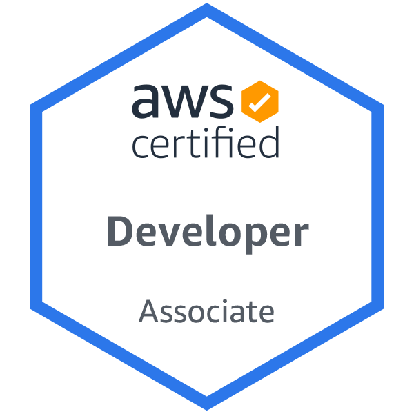
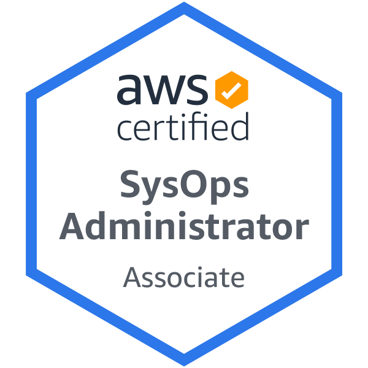

# Hi, i'm Jonas

I'm a software engineer/coder/developer, with a taste for large scale infrastructure and high-level architecture.

Having suffered through my share of Friday deployments, coding in production, and manual testing, I have become obsessed with automating things, so I can sleep well at night.

-  love bashing away at my terminal
-  currently working as a TAM for [Amazon Web Services](https://aws.amazon.com/)
-  focusing on getting my AWS Solutions Architect Professional Certification

## Gists that I'm proud of:

- [save](https://gist.github.com/jonasmcferreira/cd9de6504c1f55dd8829dc7e7d6d1269) - git save command
- [stopwatch](https://gist.github.com/jonasmcferreira/0e3a53a028d1c44cd2ade4b337ae6807) - a command line stopwatch

**Tools:**

- [bump](https://github.com/jonasmcferreira/bump) - Semantic version bumper
- [sqs2sqs](https://github.com/jonasmcferreira/sqs-2-sqs) - a tool to move messages from one SQS queue to another

**Certs:**
 

